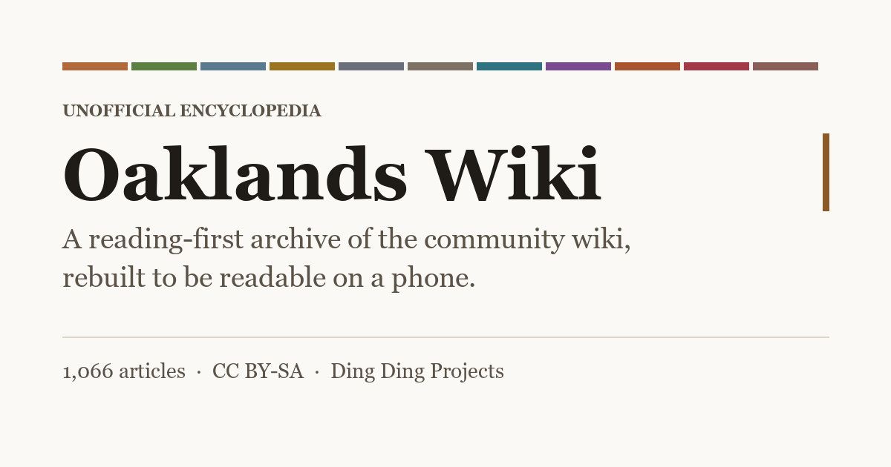
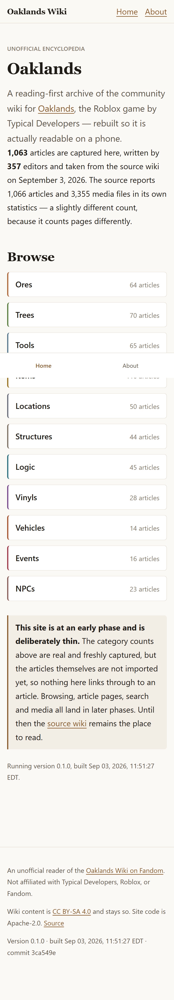
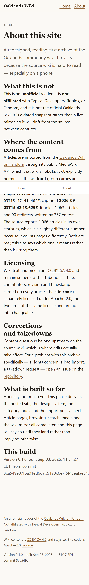

# Oaklands Wiki

A redesigned, reading-first encyclopedia for **Oaklands**, the Roblox game by Typical
Developers. It is an **unofficial** archive of the community wiki, rebuilt because the
source is hard to read — especially on a phone.

**Live site:** https://ding-ding-projects.github.io/oaklands-wiki/

> [!IMPORTANT]
> **Phase 1 — the site is hosted and deliberately thin.** The design system, hosting,
> build-output guards, category index and embed graphic are real and working. Article
> pages, browsing, search, media and the GitHub wiki mirror are **not built yet**. The
> site says so on its own front page rather than implying otherwise. See
> [ROADMAP.md](ROADMAP.md) for what is open.



## Why this exists

The source wiki's front page is a centred wall of image buttons plus an embedded chat
widget, with no reading structure. Articles are wikitext walls whose infobox tables
overflow a phone screen, and everything is wrapped in advertising. The content is good;
the reading experience is not.

<details>
<summary><strong>What this site does differently</strong></summary>

| Source wiki | Oaklands Reader |
|---|---|
| Front page is a wall of image buttons plus a chat embed | Category grid with real counts and a factual intro |
| Infobox floats right and overflows narrow screens | Key facts card, above the prose on phones |
| Every heading carries an edit pencil and sign-in link | Stripped at import; headings are headings |
| Headings embed decorative images as icons | Text headings, with meaningful art kept and described |
| Prices signalled by inline colour only | Tabular figures with aligned units; colour never the only signal |
| Advertising, sticky video, interstitials | None, and nothing third-party |
| Unbounded line length on wide screens | Prose capped near 70 characters |
| No way to compare items across articles | Comparison tables built from typed infobox records |

Each row is an inventory item with its own side-by-side capture, not a claim. Rows without
their paired capture stay open.

</details>

## Design

This site does **not** use Material Design 3. That is a deliberate, dated deviation from
the shared design standard, recorded with its reasoning in
[docs/standards/design-language.md](docs/standards/design-language.md): Material Design 3
is application chrome, and it competes with long-form reading.

Instead it uses **Oaklands Reader** — an editorial system where typography is the structure,
chrome recedes, reference objects read differently from prose on purpose, and category
identity comes from the game's own material tones.

## Content, licensing and attribution

Articles come from the [Oaklands Wiki on Fandom](https://oaklands.fandom.com) through its
public MediaWiki API, which that wiki's `robots.txt` explicitly permits for
`/api.php?action=`.

- **Wiki text and media are CC BY-SA** and remain so here, with attribution — title,
  contributors, revision and timestamp — carried on every article.
- **Site code is Apache-2.0.** The two licences are different and are not interchangeable.
- This project is **not affiliated** with Typical Developers, Roblox, or Fandom.

Content corrections belong upstream on the source wiki, where edits actually take effect.
For a problem with this archive specifically — a rights concern, a bad import, a takedown
request — please open an issue here.

## Building

```bat
download-dependencies.bat /s
build.bat /s
```

Both accept `/s` for a silent, non-interactive run and exit non-zero on the first real
failure. There is deliberately no `build-installer.bat`; this repository ships a website and
no installed application, and that exemption is recorded in
[docs/delivery/README.md](docs/delivery/README.md).

<details>
<summary><strong>npm scripts</strong></summary>

| Script | Does |
|---|---|
| `npm run dev` | Development server |
| `npm run build` | Client build, SSR build, then prerender every route |
| `npm run check:bundle` | Assert properties of the built output |
| `npm run import` | Capture the source corpus through the MediaWiki API |
| `npm run count:lines` | Line-count breakdown with authorship attribution |

</details>

## What it looks like

Real captures from the live site, taken through an isolated headless browser at a
390x844 phone viewport — not mockups, and not a narrowed desktop window.

<details open>
<summary><strong>Home and About, on a phone</strong></summary>

| Home | About |
|---|---|
|  |  |

Measured on the live site at that viewport, rather than asserted:

| Property | Measured |
|---|---|
| Body text | 18px at 30.6px line height (1.7) |
| Horizontal body overflow | none — `scrollWidth` equals `clientWidth` at 390px |
| Category cards | 11, minimum height 56px |
| Bottom navigation targets | 55px tall, pinned, covering no content |

</details>

> [!NOTE]
> The full-page capture shows the bottom navigation bar apparently floating
> mid-page. It is not a defect and was checked rather than assumed: with
> `captureBeyondViewport`, a `position: sticky` element is rendered at its stuck
> viewport position, which lands mid-image in a tall capture. Measured in the real
> viewport the bar sits flush at the bottom and covers nothing.

## Verification

Guards assert properties of the **built output**, never of the configuration that produced
it — a green build proves a file was written, never that it is correct. Every guard has been
observed failing on purpose and passing again on restore; a guard nobody has watched fail
proves nothing.

## License

Site code: [Apache-2.0](LICENSE). Wiki content: CC BY-SA, © its contributors.
