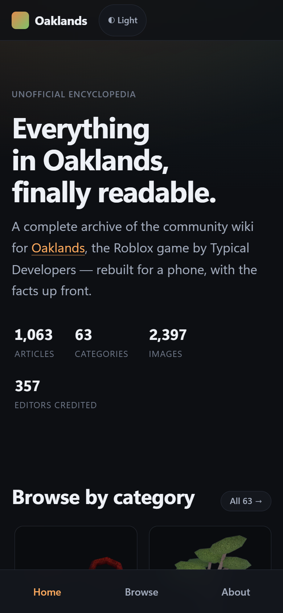
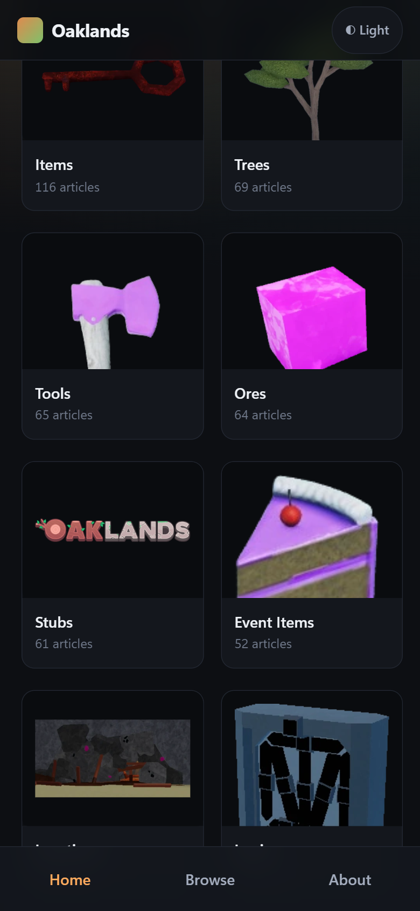
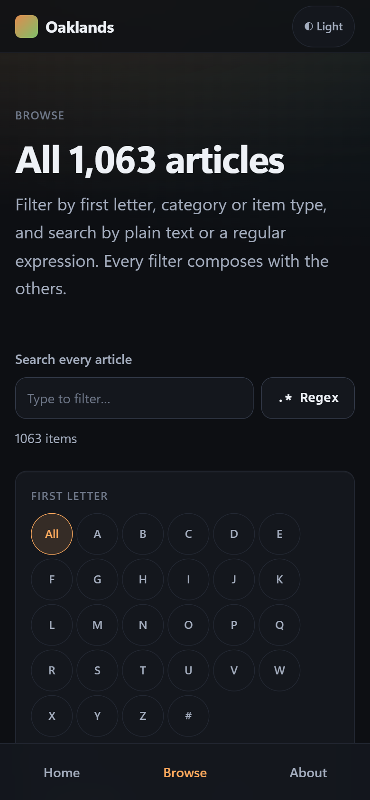
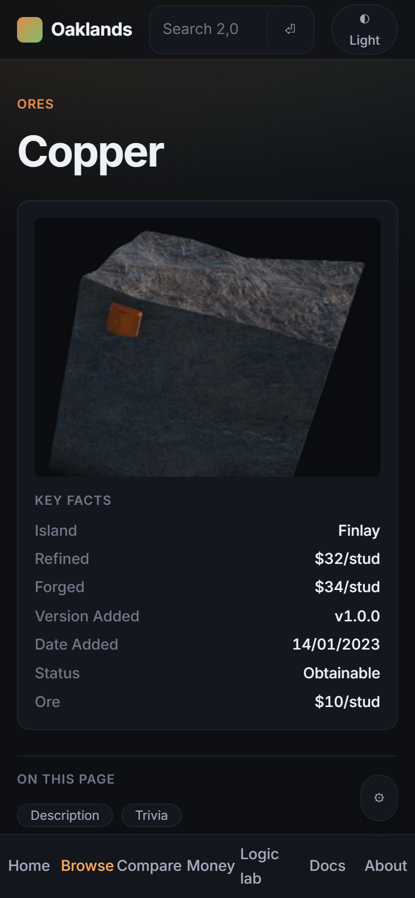
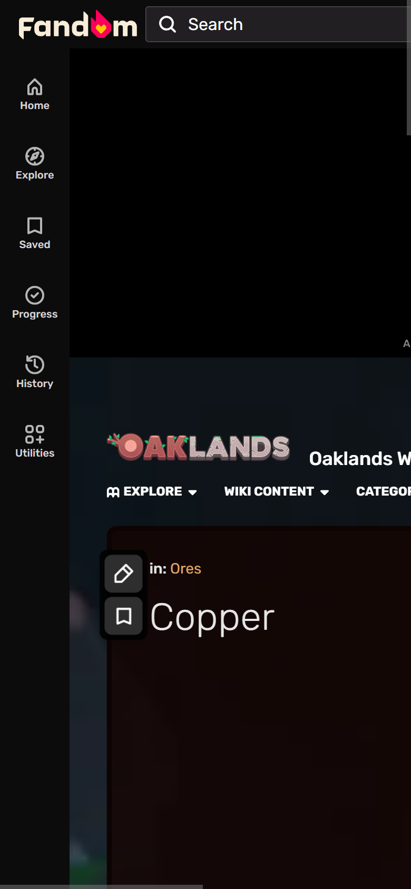
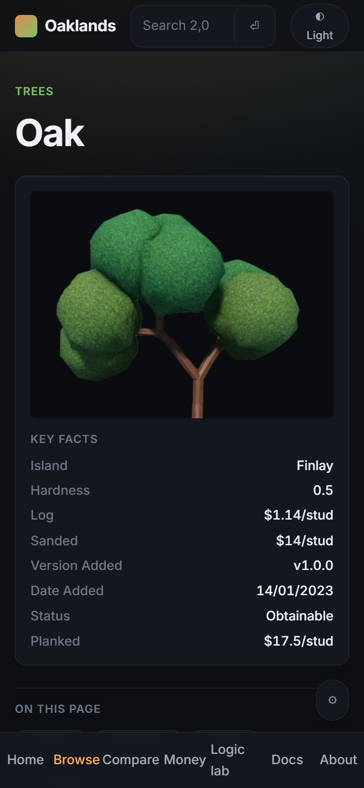
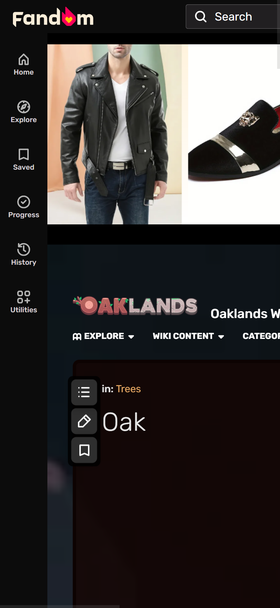

# Oaklands Wiki

A redesigned, reading-first encyclopedia for **Oaklands**, the Roblox game by Typical
Developers. It is an **unofficial** archive of the community wiki, rebuilt because the
source is hard to read — especially on a phone.

**Live site:** https://ding-ding-projects.github.io/oaklands-wiki/

> [!NOTE]
> **The archive is complete and readable.** All 1,063 articles, 63 categories and their
> images are live on the site and mirrored to the GitHub wiki. Audio and video are not
> archived yet and show a placeholder naming the file. The wider settings surface —
> language modes, per-element appearance, the command palette — is still open; see
> [ROADMAP.md](ROADMAP.md).


## Why this exists

The source wiki's front page is a centred wall of image buttons plus an embedded chat
widget, with no reading structure. Articles are wikitext walls whose infobox tables
overflow a phone screen, and everything is wrapped in advertising. The content is good;
the reading experience is not.

<details>
<summary><strong>What this site does differently</strong></summary>

| Source wiki | Oaklands Reader |
|---|---|
| Front page is a wall of image buttons plus a chat embed | Category grid with real counts and a factual intro |
| Infobox floats right and overflows narrow screens | Key facts card, above the prose on phones |
| Every heading carries an edit pencil and sign-in link | Stripped at import; headings are headings |
| Headings embed decorative images as icons | Text headings, with meaningful art kept and described |
| Prices signalled by inline colour only | Tabular figures with aligned units; colour never the only signal |
| Advertising, sticky video, interstitials | None, and nothing third-party |
| Unbounded line length on wide screens | Prose capped near 70 characters |
| No way to compare items across articles | Comparison tables built from typed infobox records |

Each row is an inventory item with its own side-by-side capture, not a claim. Rows without
their paired capture stay open.

</details>

## Design

This site does **not** use Material Design 3. That is a deliberate, dated deviation from
the shared design standard, recorded with its reasoning in
[docs/standards/design-language.md](docs/standards/design-language.md).

It uses **Oaklands Reader v2** — dark by default with a light theme, one variable sans
throughout, image-forward tiles, depth from a single soft shadow rather than stacked greys,
and category identity taken from the game's own material tones.

Two things it does that are easy to get wrong:

- **No element renders at browser defaults.** 65 elements get a deliberate treatment; 11 are
  deliberately left to inherit with the reason recorded. Enforced by a hand-written list,
  because a guard that only validates the elements already styled passes cleanly on a
  stylesheet that styles nothing.
- **The theme control is not a React component.** Article pages ship no JavaScript at all,
  so a React toggle would be a button that does nothing there. It is a kilobyte of inline
  script that works on every page.

## Content, licensing and attribution

Articles come from the [Oaklands Wiki on Fandom](https://oaklands.fandom.com) through its
public MediaWiki API, which that wiki's `robots.txt` explicitly permits for
`/api.php?action=`.

- **Wiki text and media are CC BY-SA** and remain so here, with attribution — title,
  contributors, revision and timestamp — carried on every article.
- **Site code is Apache-2.0.** The two licences are different and are not interchangeable.
- This project is **not affiliated** with Typical Developers, Roblox, or Fandom.

Content corrections belong upstream on the source wiki, where edits actually take effect.
For a problem with this archive specifically — a rights concern, a bad import, a takedown
request — please open an issue here.

## Building

```bat
download-dependencies.bat /s
build.bat /s
```

Both accept `/s` for a silent, non-interactive run and exit non-zero on the first real
failure. There is deliberately no `build-installer.bat`; this repository ships a website and
no installed application, and that exemption is recorded in
[docs/delivery/README.md](docs/delivery/README.md).

<details>
<summary><strong>npm scripts</strong></summary>

| Script | Does |
|---|---|
| `npm run dev` | Development server |
| `npm run build` | Client build, SSR build, then prerender every route |
| `npm run check:bundle` | Assert properties of the built output |
| `npm run import` | Capture the source corpus through the MediaWiki API |
| `npm run count:lines` | Line-count breakdown with authorship attribution |

</details>

## What it looks like

Real captures from the live site through an isolated headless browser at a 390x844 phone
viewport — not mockups, and not a narrowed desktop window.

| Home | Category tiles | Browse |
|---|---|---|
|  |  |  |

Measured on the live site rather than asserted:

| Property | Measured |
|---|---|
| Horizontal body overflow | none at 390px |
| Category tiles with real art | 20 of 24 on the home page; 60 of 63 categories overall |
| Articles with art | 885 of 1,063 |
| Browse filtering | 1,063 rows narrow to 87 on "C", starting at Cactus |
| Theme control | present and functional on every page, including the script-free article pages |

## Everything is reachable

The source wiki sends you elsewhere in three ways, and each one left a hole here.
Internal links that went nowhere fell from **1,970 to 16**:

| Link kind | Occurrences | Now goes to |
|---|---:|---|
| `Category:…` | 885 | the category page, which already existed |
| `File:…` | 891 | one of 836 new file pages |
| `Template:… Nav` | 178 | the category that navigation box lists |
| Alternate names | — | a page of their own, content and all |
| `Special:` `User:` `Module:` | 16 | still plain text, on purpose |

Those last sixteen are the source wiki's own machinery — a What-links-here query, an
upload form, contributor pages. A static archive has nothing to point them at, so they
say so rather than pretending. Detail in
[docs/features/no-redirects.md](docs/features/no-redirects.md).

## Search

A search field in the top bar of **all 2,053 pages**, as a plain `<form method="get">`.
Most of this site is prerendered HTML that never hydrates, so a search needing
JavaScript would be decoration on the majority of it. Enter reaches `/search/`, which
holds one index over every article, alternate name, category, file and standing page —
2,053 entries, 119KB gzipped, fetched only there.

## Making money

At [`/money/`](https://ding-ding-projects.github.io/oaklands-wiki/money/): every sell
price the wiki records, ranked by what it earns **and** by how hard it is to get.

The two are computed separately, and that is the whole point. Scoring difficulty from
value and then ranking by value is circular — every expensive thing comes out "hard" by
construction, and "worth a lot, easy to reach" becomes impossible to express. So
difficulty reads only region, processing steps and obtainability, never price.

Which is how the useful answer surfaces: **Magnetite, $600 a stud, on the starting
island, difficulty 1.5.**

Three defects were caught while building it, each of which would have shipped a
confidently wrong guide:

- The generic `Price` field is what a thing **costs**. 398 items carrying it also carry a
  `Shop` or `Cost` field. Reading those as income put a $10,000,000 shop-bought warhead —
  the biggest money sink in the game — at number one.
- The unit comes from the value, never the field name. A beehive's `Log` is a flat
  `$1389`, not per stud; trusting the label put it thirty times above every real per-stud
  price. Per-stud and per-item are separate tables now, and never compared.
- The event-currency filter caught `❅` U+2745 and missed `❄️` U+2744, so a log priced at
  one snowflake per stud was read as one dollar.

The method is published on the page itself, so a reader can disagree with the model
rather than with the conclusion. Detail in
[docs/features/money-guide.md](docs/features/money-guide.md).
## Side by side with the source

The source wiki being hard to read is why this project exists, so "visibly different" is a
requirement with its own inventory rows rather than a side effect of choosing nice fonts.
Both columns below are the same article, captured in the same run, at the same tuple:
390x844, device scale 2, mobile.

| | This site | The source wiki |
|---|---|---|
| **Copper** |  |  |
| **Oak** |  |  |

At a phone width the source puts a persistent icon rail and an advertising slot ahead of
the article, and the page itself scrolls sideways. This site starts the article at the top
of the viewport, and the body never scrolls sideways at any of the five tested viewports.

Nine such failings are recorded in [`design/differentiation-inventory.json`](design/differentiation-inventory.json),
each naming what the source does, the counter-treatment here, and the paired capture that
shows it. `npm run check:parity` fails when a row loses its evidence, so a claim cannot
outlive the picture that backs it.

## Verification

Guards assert properties of the **built output**, never of the configuration that produced
it — a green build proves a file was written, never that it is correct. Every guard has been
observed failing on purpose and passing again on restore; a guard nobody has watched fail
proves nothing.

The full method, every measured figure and the honest limits are in
[`docs/delivery/verification.md`](docs/delivery/verification.md). In summary, measured on the
deployed site across 8 surfaces x 5 viewports:

```
checked 40 surface/viewport combinations
  horizontal overflow : 0
  unnamed controls    : 0
  images without alt  : 0
  h1 count not 1      : 0
  targets under 24px  : 0
  elements overflowing: 0
```

| Command | Refuses |
|---|---|
| `npm run check:bundle` | A missing base path, a remote asset, injected `<style>`, absent OG tags, a drifted article count, a token declared twice, or a stale `dist/` |
| `npm run check:elements` | A required element absent from the built markup |
| `npm run check:completeness` | A feature row without its implementation, docs or evidence |
| `npm run check:parity` | A reference screen or differentiation pair that is missing, incomplete or drifted |
| `npm run check:wiki` | A corpus article with no generated wiki page, or an internal link that does not resolve |

`npm run check:self-tests` breaks each guard on purpose, one field at a time, and requires
every mutation to turn it red and the unmutated inventory to turn it green.

Nothing runs in CI: by standing policy the release workflow runs no tests and no lint, and
no code-quality verdict gates a release. The suites here run locally in the task that
changes the code. The cost is stated plainly rather than hidden — a release can ship from a
commit whose local checks would have failed.

## License

Site code: [Apache-2.0](LICENSE). Wiki content: CC BY-SA, © its contributors.
